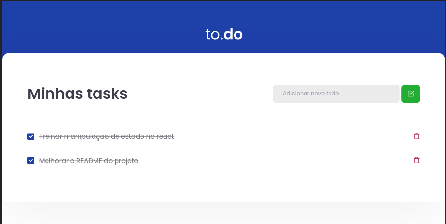

<h1 align="center">
  
</h1>

  <a href="#-tecnologias">Tecnologias</a>&nbsp;&nbsp;&nbsp;|&nbsp;&nbsp;&nbsp;
  <a href="#-projeto">Projeto</a>&nbsp;&nbsp;&nbsp;|&nbsp;&nbsp;&nbsp;
  <a href="#-layout">Layout</a>&nbsp;&nbsp;&nbsp;|&nbsp;&nbsp;&nbsp;
  <a href="#memo-licença">Licença</a>

 

  

 

  

## 🚀 Tecnologias

Esse projeto foi desenvolvido com as seguintes tecnologias:

- React
- Typescript
- Jest
- Yarn
- Sass
  
## 💻 Projeto

Um To do list feito com o intuito de praticar a manipulação de estado em React, projeto feito como desafio I da trilha de React da Rocketseat

## 👨‍💻 Como-rodar-o-projeto

Você precisa ter o <strong>Node.js</strong> instalado na sua máquina. Senão tiver você pode fazer o download através [desse link](https://nodejs.org/en/download/).
Com o Node instalado na máquina, vc precisa apenas de 2 comandos (no terminal) na pasta do projeto, nessa ordem:
1. `npm install` -> Para instalar as dependências do projeto. (só precisa ser executado uma vez) 
2. `npm run dev` -> Para iniciar o servidor local (para acessar o projeto via navegador, digite na barra de endereço: localhost:8080) 

## :memo: Licença

Esse projeto está sob a licença MIT. Veja o arquivo [LICENSE](../../challenges/React-To-do-list/LICENSE) para mais detalhes.

---

Feito com ♥ by Felipe Melo